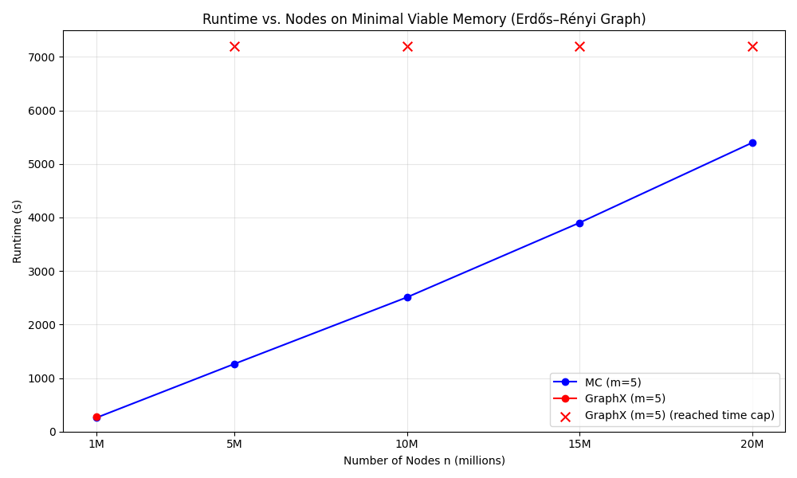
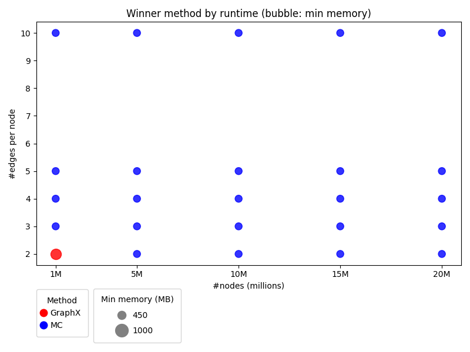
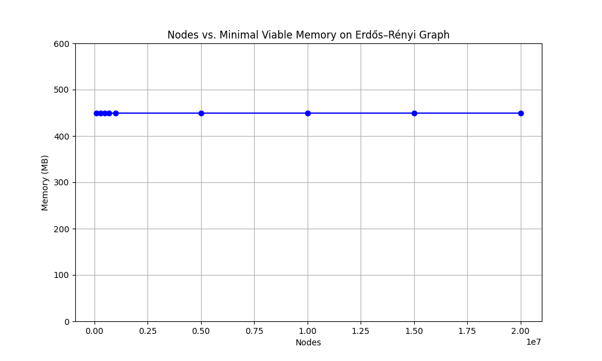
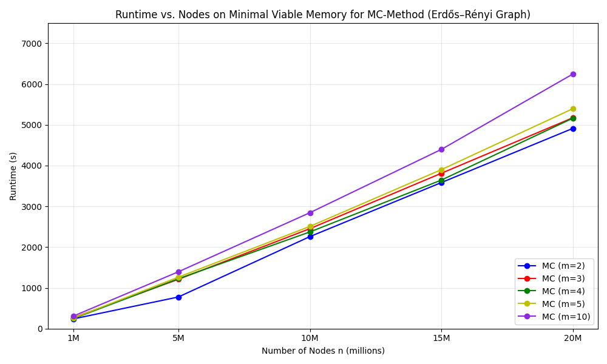
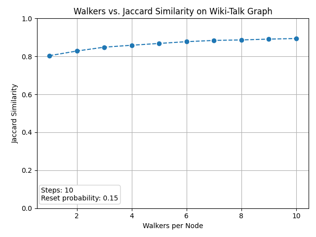
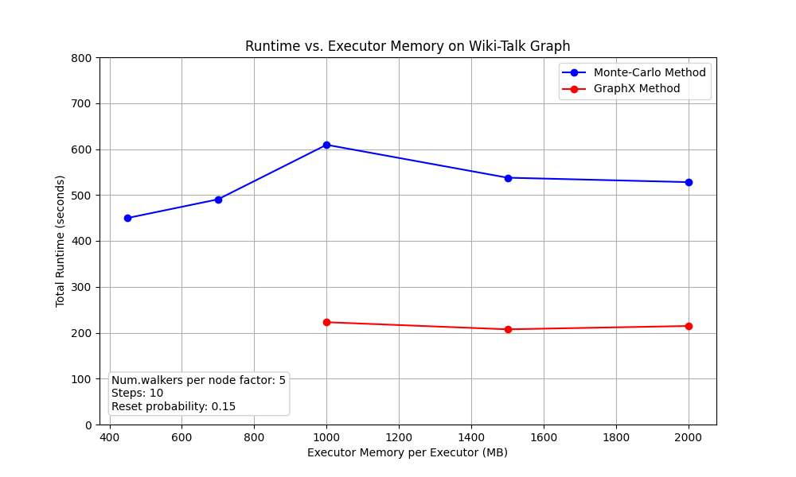

Hier habe ich syntethische ER Graphen mit verschiedenen Anzahlen an Knoten erstellt un dann die PageRank mit beiden Methoden laufen lassen. Die Kreuze sind die Durchläufe die entweder wegen zu wenig Memory abgebrochen sind oder die ich nach 2h selber abgebrichen habe.  
Genau die gleichen Graphen möchte ich noch für verschiedene edges machen. 

Hier dachte ich, könnt eman ganz gut zeigen welche Methode für welche Graphen am besten geeignet ist. Die schnellere Methode "gewinnt" und die Größe der Bubbles zeigt an wie viel Memory die Methode dabei minimal braucht. Das sieht irgendwie komisch aus für mich aber ich weiß nicht wie man es besser darstellen könnte.

Hierbei handelt es sich nur um die Monte Carlo Methode bei 5 edges. Bei der MC Methode ist minnimal Memory aber immer 450m, daher weiß ich nicht wie viel Sinn dieser Plot macht.

Hier habe ich einfach einen Plot mit der MC Methode mit verschiedenen Anzahlen an edges gemacht. Ich würde aber eher jeweils die zwei Methoden mit verschiedenen Anzahlen an edges vergleichen wie oben beim ersten Plot.

Die Genauigkeit der MC Methode im Vergleich zur GraphX Methode. Ich habe einfach die top 20 ranks der beiden Methoden verglichen und den Prozentsatz der Übereinstimmung berechnet.

Die performance der beiden Methoden verglichen. Hier bracht die GraphX Methode mindestens 1000m memory, davor failed sie.
Nodes: 2394385
Edges: 5021410

